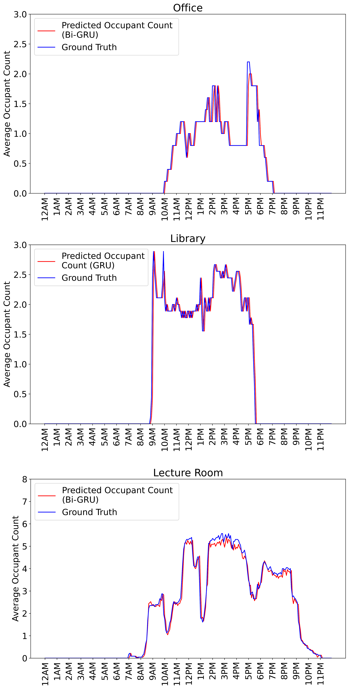

# cot-phoenix
This repository contains the source code for the feature selection algorithm and deep learning models (DNN, GRU, bi-GRU, LSTM, bi-LSTM) implemented for occupancy prediction across multiple space types based on a minimum sensing approach.

## Data 
Dataset used to perform occupant count predictions can be found here:
https://doi.org/10.6084/m9.figshare.19234530.v7

If you are interested in using this dataset, please cite our following work: 
Tekler, Zeynep Duygu, et al. "ROBOD, room-level occupancy and building operation dataset." Building Simulation. Tsinghua University Press, 2022. https://doi.org/10.1007/s12273-022-0925-9

## Approach

This study performs occupancy prediction based on a minimum sensing strategy by using a comprehensive set of sensor data (i.e., indoor environmental and outdoor weather conditions, Wi-Fi connected devices, energy consumption data, HVAC operations, and time-related information) to identify the most crucial features through a proposed feature selection algorithm. Occupancy predictions were subsequently performed using different deep learning architectures, including Deep Neural Network (DNN), Long Short-Term Memory (LSTM), Bi-directional LSTM (Bi-LSTM), Gated Recurrent Unit (GRU), and Bi-directional GRU (Bi-GRU) in an office, library, and lecture room. Our findings highlighted that the proposed feature selection algorithm outperformed a popular feature selection algorithm to achieve a higher model performance with lower sensing requirements. Furthermore, empirical results showed that indoor $CO_2$ levels and Wi-Fi connected devices were crucial features for predicting occupancy across all space types. The best model performances were achieved using Bi-GRU for office, GRU for library, and Bi-GRU for lecture room.

## Predicted vs Ground Truth Occupant Count for Office, Library and Lecture Room

